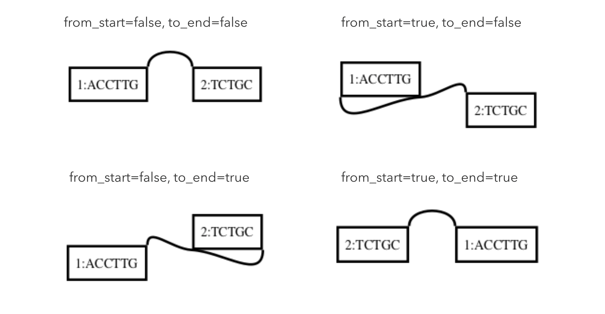

# vgのファイルフォーマット 1


ゲノム**配列**はFASTAフォーマット、線形アラインメントはSAM/BAM, PAFなどのフォーマットで表されていますが、これらのファイルフォーマットでゲノム**グラフ**を表現するのはちょっと厳しいため、グラフ専用のものを用意する必要があります。

2日目は、`vg`がゲノムグラフとそのインデックスをどのようなフォーマットで表現しているのかを整理します。
(アラインメントを表現するGAMは明日に回します。)


## ゲノムグラフを表すフォーマット

ゲノムグラフを表現するためのフォーマットとしては例えば、

* VG : Variation Graph
    * https://github.com/vgteam/libvgio/blob/master/deps/vg.proto
* GFA : Graphical Fragment Assembly
    * https://github.com/GFA-spec/GFA-spec
* rGFA: Reference Graphical Fragment Assembly
    * https://github.com/lh3/gfatools/blob/master/doc/rGFA.md#the-reference-gfa-rgfa-format
    * GFAのサブセットで、グラフの"座標系"を安定に保つためにいくつかのタグを追加したもの
    * [RGFA](https://github.com/ggonnella/rgfa)とは違います。(これはRubyで実装したGFAのハンドラ)
* FASTG : FASTa like Graph (本当か？)
    * http://fastg.sourceforge.net/

などがあります。ここでは`vg` が直接扱うことができるGFAとVG(とそのJSON表現)を取りあげます。
(表記揺れすると辛いので、コマンドラインツールとしてのvgは `vg` 、ファイルフォーマットはVGと表現することにします。)


### VG

VG形式は`vg`における基本フォーマットで、グラフオブジェクトをProtocol Buffersでシリアライズしたバイナリファイルです。（実際には違いますが）JSONのバイナリバージョンくらいの気持ちでいればいいと思います。どうしても中身を見たい場合は、

```shell
$ vg view -j graph.vg > graph.json
```

のようにJSONに吐いて中身をみると対応関係がわかりやすいと思います。とりあえずグラフでなにかしたいと思ったら、 **まずはVG形式のファイルを用意する** ところから始める、と覚えましょう。

以下もう少し細かいところまで[コード](https://github.com/vgteam/libvgio/blob/master/deps/vg.proto)を読んでみます。


#### [Graph](https://github.com/vgteam/libvgio/blob/master/deps/vg.proto#L7-L17)

`vg` におけるゲノムグラフは、ノード型のリスト、エッジ型のリスト、パス型のリストから構成されます。

```protobuf
message Graph {
    repeated Node node = 1;
    repeated Edge edge = 2;
    repeated Path path = 3;
}
```


#### [Node](https://github.com/vgteam/libvgio/blob/master/deps/vg.proto#L19-L24)

グラフの部品となる塩基配列を記述する。

```protobuf
message Node {
    string sequence = 1; // 塩基配列
    string name = 2;
    int64 id = 3;        // ノードID。vgでは1-originの整数値で識別する。
}
```


#### [Edge](https://github.com/vgteam/libvgio/blob/master/deps/vg.proto#L26-L36)

ノード同士の繋がりを記述する。

```protobuf
message Edge {
    int64 from = 1;
    int64 to = 2;
    bool from_start = 3; // 5'からエッジが生えるならtrue
    bool to_end = 4;     // 3'へとエッジが向かうならtrue
    int32 overlap = 5;   // De Bruijn graphとかを表現するのに使う。
}
```

ゲノムには5'→3'という向きがあります。たとえば `ACCTTG` という塩基配列について、`CAAGGT`という相補鎖が存在します。
ゲノムグラフを一般的な有向グラフとみなすだけでは、いわゆる逆位を同じノードで表現することができません。そこで`vg`では有向グラフに、エッジがノードのどこから生えてノードのどこに向かうかという情報を加えることで、ゲノムグラフを実現しています。ファイルフォーマットの上では `from_start` と `to_end` という2つのbool値で管理しています。`from_start` と `to_end` の値によってグラフがどう変わるのかは、言葉で説明するより絵でみた方が早いと思うので、全パターンの図を載せます。

* `from_start=false, to_end=false` のとき(一番シンプルなパターン)


* `from_start=false, to_end=true` のとき


`ACCTTGGCAGA` を表します。

* `from_start=true, to_end=false` のとき


`CAAGGTTCTGC` を表します。

* `from_start=true, to_end=true` のとき(どっちも逆向き)


`CAAGGTGCAGA` を表します。

これらを`vg`でdotファイルに吐いて、Graphvizで可視化すると↓のようになります。



この辺を数学的(?)にいい感じに扱う(?)方法は、別の日に回します。


#### [Path](https://github.com/vgteam/libvgio/blob/master/deps/vg.proto#L94-L107)

グラフを作るのに使用した配列がどのノードをどの順番に通るかを記述する。目的は座標系を担保すること。

```protobuf
message Path {
    string name = 1;              // パスの名前。だいたいはFASTAのSeqIdが入る
    repeated Mapping mapping = 2; // いろいろ入れ子になっているが、どのノードをどの順番に通るかを記述していると思えば良い
    bool is_circular = 3;         // 環状かどうかのフラグ。バクテリアとかプラスミドとか
    int64 length = 4;
}
```

各ノードをどのように通るのか記述するのが `Mapping` です。

```protobuf
message Mapping {
    Position position = 1;  // ノードを表す配列や向きなどの情報。VG形式ではノードIDのことだと思えばよい
    repeated Edit edit = 2; // CIGARのようなイメージ。VG形式ではノードの長さが入ると思えばよい
    int64 rank = 5;         // パス中では何番目にこのノードを通るか
}
```

`Position` と `Edit` はGAMで重要になりますが、VGではコメントにメモしたところだけ知っていればいいと思うので今はスキップ。


ここで、Pathを読む練習をしてみましょう。

```
seq1: ATGTCACACGTAA
seq2: ATGTCAGACGTAA
```

のような2つの配列があったとき、グラフは


というイメージになると思います。このグラフにおけるパス`seq1`は次のように表されます。

```json
"path": [
    {
      "mapping": [
        {
          "edit": [
            {
              "from_length": 6,
              "to_length": 6
            }
          ],
          "position": {
            "node_id": "1"
          },
          "rank": "1"
        },
        {
          "edit": [
            {
              "from_length": 1,
              "to_length": 1
            }
          ],
          "position": {
            "node_id": "2"
          },
          "rank": "2"
        },
        {
          "edit": [
            {
              "from_length": 6,
              "to_length": 6
            }
          ],
          "position": {
            "node_id": "4"
          },
          "rank": "3"
        }
      ],
      "name": "seq1"
    },
  (以下略)
```


### GFA

GFAはもともとはアセンブリグラフを記述するために作られたタブ区切り形式のテキストファイルです。バージョンは1と2がありますが、ここではv1だけを扱います。

1列目がRecordTypeで、ここでグラフのノード・エッジ・パスのどれかを判定します。
とりあえず、`S`, `L`, `P` だけ覚えれば困らないと思います。

さっきのグラフをGFA v1で表したものを題材に整理します。

```
H	VN:Z:1.0
S	1	ATGTCA
S	2	C
S	3	G
S	4	ACGTAA
L	1	+	2	+	0M
L	1	+	3	+	0M
L	2	+	4	+	0M
L	3	+	4	+	0M
P	1	1+,2+,4+	6M,1M,6M
P	2	1+,3+,4+	6M,1M,6M
```


#### `H`

ヘッダ行


#### `S`
Segmentの頭文字で、ノードを表現する行。左から、

1. `S`
2. ノードID: string
3. 塩基配列: string

です。ノードIDはstringなので、ゲノムアセンブラによってはここにカバレッジなどいろんな情報を載せていたりします(Bandageで可視化するときとかに使う)。ただ、VGは1-originのint64を想定しているので、GFA v1で吐かれたアセンブリグラフなどを変換するときは、自前でノードIDを修正しておく必要があります。


#### `L`
Linkの頭文字で、エッジを表現する行。左から、

1. `L`
2. エッジが出るノードID: string
3. `FromOrient`: `+` or `-`
4. エッジの向かう先のノードID: string
5. `ToOrient`: `+` or `-`
6. CIGAR: string

2, 4列目がVGにおける `from` と `to` に対応しています。
3, 5列目はVGにおける `from_start` と `to_end` のことです。ややこしいのは、 `from_start=false` に対応するのが `FromOrient=+` で、 `from_start=true` に対応するのが `FromOrient=-` であるということです。
6列目にはCIGARが入ります。たとえば、31-merのde Bruijn graphだと `30M` が入ります。


#### `P`
Pathの頭文字。左から、

1. `P`
2. Pathの名前: string
3. カンマ区切りのノードID: string
4. カンマ区切りのノードのCIGAR: string

4列目はCIGARなのでいろいろ表現できるが、最初のうちは `(ノードの塩基数)M` が入ると思っておけばよいと思います。Optionalなので、ワイルドカードが入っているだけのケースもそれなりにあります。


## アラインメントのインデックス

`vg` のアラインメントは、seed-extendベースの方法です。BLASTやBWAがアラインメントの前処理でインデックスファイルを作っていたように、`vg` も検索用のインデックスを作っておく必要があります。インデックスが何に使われるのかを紹介することは線形アラインメントツールではほとんどないと思いますが、`vg` では明示的に使い分ける必要があるので取りあげます。登場人物は、 XG, GCSA, GBWTです。
(あくまでどういう用途で使うかを箇条書きで紹介するだけで、中身は説明しません。自分もわからないので。。)


### [XG](https://github.com/vgteam/xg)

* バイナリ
* VGを簡潔データ構造に変換したもの(つまり中身は等価)
* ゲノム配列フォーマットに無理やり例えるなら、fa+fai
* VGはさまざまなファイルフォーマットとの相互変換やグラフの編集に使える動的フォーマットなのに対してが、XGフォーマットは検索に特化した静的フォーマット。編集は普通しない
    * たとえば、 `vg map` や `vg find` で活躍する


### [GCSA](https://github.com/jltsiren/gcsa2)

* バイナリ
* Generalized Compressed Suffix Array の略
* `vg map` とかでseed探索とかに使う
* 中身はすごくざっくり言うと、グラフからk-merを全列挙して作ったsuffix array
* 拡張子は `.gcsa` だが、実装されているのはGCSA2
  * ループに対応しているか、などの違いがある


### [GBWT](https://github.com/jltsiren/gbwt)

* バイナリ
* Graph Burrows-Wheeler Transform の略
* ハプロタイプのインデックス
* スコアを計算するときに使う


## 編集・更新に対するグラフの安定性

Pathのところで「目的は座標系を担保すること」とサラッと書いてしまったので、補足(=冒険)です。例として、ノードを切るという編集を考えてみましょう。


というグラフがあるとします。これをノードの長さが5bpになるように切ると、


のようになります。切られた結果、ノードIDの値が飛んでいます。アノテーションをつけていた場合はそのアノテーションは壊れてしまいます。そのため、グラフはうかつには編集できなくなってしまいます。

このような編集に対しても安定した座標があることを保証するために、グラフにパスを埋め込んでいるというわけです。グラフを編集したとしても、パスを辿って得られる配列が変わっていないなら生物学的な情報は失われていません。


もっと顕著な例としてあるのが、ヒトゲノムのリファレンスのバージョン更新問題です。グラフを導入したいモチベーションの1つとして、複数の座標系を埋め込めるというのがあるのですが、現状だと辛い局面というのがいくつかあります。Heng Liが提案している MiniGraphというグラフ構築手法の実装とそれを表現するrGFAフォーマットはこの問題を解決する一つモデルです。


この辺の詳しい話は、Heng Li と Erik Garisson のブログ上での議論を読むのが良いでしょう。

* Heng Li
  * [On a reference pan-genome model](http://lh3.github.io/2019/07/08/on-a-reference-pan-genome-model)
  * [On a reference pan-genome model (Part II)](http://lh3.github.io/2019/07/12/on-a-reference-pan-genome-model-part-ii)
* Erik Garisson
  * [Untangling graphical pangenomics](https://ekg.github.io/2019/07/09/Untangling-graphical-pangenomics)


## まとめ

### 相関図

登場人物がたくさん登場したので、それっぽい相関図に整理してみました。具体的にどうやって変換していくのかは、今後のコマンド紹介で扱うことになります。


### グラフフォーマットの違い

VG, GFA, rGFA の比較

* rGFAはGFAのサブセット
* VGとGFAの違いは型の制約
  * ノードIDとオーバラップはVGの方が厳しい(し、オーバラップはほとんど使われない)
  * パスはVGの方が(定義上は)いろいろ表現できる


ちょっと量が多くなってしまったので、GAMは明日に回します。

Snarlsも[vg.proto](https://github.com/vgteam/libvgio/blob/master/deps/vg.proto)で定義されているものですが、説明をいれるタイミングがなかったので、別の日に回します。


### 参考

* https://github.com/vgteam/vg/wiki/File-Formats
* https://github.com/vgteam/vg/wiki/Visualization