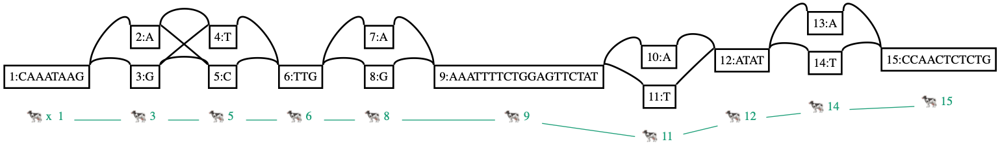

# vgのファイルフォーマット 2

昨日に引き続きフォーマットのお話です。グラフアラインメントを表すGAMフォーマットについて整理します。


## グラフアラインメントの結果

ゲノムグラフに対してクエリ配列をアラインメントした結果はGAMファイルに吐かれます。

### GAM

SAM/BAMのグラフバージョンという立ち位置です。VGと同じでProtocol Buffersでシリアライズしたバイナリファイルです。中身がみたい場合は、

```shell
$ vg view -a aln.gam > aln.json
```

とJSONに吐いて対応関係をみます。アラインメント結果をフィルタリングしたりするときは、JSONに吐いて `jq` コマンドでこねくり回したりもします。

以下もう少し細かいところまで[コード](https://github.com/vgteam/libvgio/blob/7d539bd/deps/vg.proto)を読んでみます。

#### [Alignment](https://github.com/vgteam/libvgio/blob/7d539bd/deps/vg.proto#L109-L151)

すごくたくさんありますが、だいたいはSAMと同じで、説明しないといけないのは`Path` なので、そこだけ詳しくみていきます。

```protobuf
message Alignment {
    string sequence = 1;
    Path path = 2;
    string name = 3;
    bytes quality = 4;
    int32 mapping_quality = 5;
    int32 score = 6;
    int32 query_position = 7;
    reserved 8;
    string sample_name = 9;
    string read_group = 10;
    Alignment fragment_prev = 11;
    Alignment fragment_next = 12;
    bool is_secondary = 15;
    double identity = 16;
    repeated Path fragment = 17;
    repeated Locus locus = 18;
    repeated Position refpos = 19;
    
    bool read_paired = 20;
    bool read_mapped = 21;
    bool mate_unmapped = 22;
    bool read_on_reverse_strand = 23;
    bool mate_on_reverse_strand = 24;
    bool soft_clipped = 25;
    bool discordant_insert_size = 26;
    double uniqueness = 27;
    double correct = 28;
    repeated int32 secondary_score = 29;
    double fragment_score = 30;
    bool mate_mapped_to_disjoint_subgraph = 31;
    
    string fragment_length_distribution = 32;
    reserved 33 to 34;
    double time_used = 35;
    Position to_correct = 36;
    bool correctly_mapped = 37;
    
    google.protobuf.Struct annotation = 100;
}
```

#### [Path](https://github.com/vgteam/libvgio/blob/7d539bd/deps/vg.proto#L94-L107)

アラインメントの文脈でも使うことができます。Mappingの情報から、アラインメントの差分をグラフに取り込むことに使ったりします。

```protobuf
message Path {
    string name = 1;              // クエリ配列の名前
    repeated Mapping mapping = 2; // どのノードにどの順番でどのようにアラインされたか
    bool is_circular = 3;
    int64 length = 4;
}
```

#### [Mapping](https://github.com/vgteam/libvgio/blob/7d539bd/deps/vg.proto#L60-L64)

ノードの配列のどこにどのように貼りついたか。`Mapping` 以下は配列同士の比較を表現しています。

```protobuf
message Mapping {
    Position position = 1;  // 下記参照
    repeated Edit edit = 2; // CIGAR stringのようなもの
    int64 rank = 5;
}
```

#### [Position](https://github.com/vgteam/libvgio/blob/7d539bd/deps/vg.proto#L87-L92)

ノードの配列における位置情報

```protobuf
message Position {
    int64 node_id = 1;
    int64 offset = 2;    // ノード中の配列の何番目が開始点か。0-origin
    bool is_reverse = 4; // 相補鎖に当たったか。逆位とかpaired-endリードのreverseとか
    string name = 5;
}
```

#### [Edit](https://github.com/vgteam/libvgio/blob/7d539bd/deps/vg.proto#L50-L54)

CIGARの一要素のようなもの

```protobuf
message Edit {
    int32 from_length = 1;
    int32 to_length = 2;
    string sequence = 3;
}
```

* `from_length == to_length` で、 `sequence == null` の場合は完全マッチ
* `from_length == null` で、 `to_length != null ` かつ `sequence != null` の場合は挿入
* `to_length == null` で、 `from_length != null ` かつ `sequence == null` の場合は欠失
* `from_length == to_length` で、 `sequence != null` の場合は置換

たとえば、

```json
"edit": [
  {
    "from_length": 3,
  }
]
```

だと、3塩基の欠失だし、

```json
"edit": [
  {
    "to_length": 5,
    "sequence": "ACTGC"
  }
]
```

だと、5塩基の挿入がありその中身は `ACTGC` である、といった具合です。

また、`Mapping` の `from_length` の合計はノードの配列長になるし、`Path` の `to_length` の合計はクエリ配列長になります。


#### GAMを読む練習



というグラフに対するアラインメントを考えます。


グレーのパスは`x` で、暖色のパスはアラインされたリードを表しています。

(JSONをそのまま載せているので、無駄に縦に長いです。)

##### 完全マッチの場合

`identity=1` なので完全マッチです。どのように貼りついたかは mapping をみます。最初の要素には、offsetの情報がついてきます。今回だと、 `node_id=1` の4塩基目から貼りついているので、`offset=3` です。完全マッチなので、 `from_length` = `to_length` です。

```json
{
  "identity": 1,
  "name": "db041e5778b2f649",
  "path": {
    "mapping": [
      {
        "edit": [
          {
            "from_length": 5,
            "to_length": 5
          }
        ],
        "position": {
          "node_id": "1",
          "offset": "3"
        }
      },
      {
        "edit": [
          {
            "from_length": 1,
            "to_length": 1
          }
        ],
        "position": {
          "node_id": "3"
        }
      },
      {
        "edit": [
          {
            "from_length": 1,
            "to_length": 1
          }
        ],
        "position": {
          "node_id": "4"
        }
      },
      {
        "edit": [
          {
            "from_length": 3,
            "to_length": 3
          }
        ],
        "position": {
          "node_id": "6"
        }
      },
      {
        "edit": [
          {
            "from_length": 1,
            "to_length": 1
          }
        ],
        "position": {
          "node_id": "8"
        }
      },
      {
        "edit": [
          {
            "from_length": 9,
            "to_length": 9
          }
        ],
        "position": {
          "node_id": "9"
        }
      }
    ]
  },
  "refpos": [
    {
      "name": "x",
      "offset": "3"
    }
  ],
  "score": 30,
  "sequence": "ATAAGGTTTGGAAATTTTCT"
}
```


##### SNV+insert

挿入は、図では `*` で表現されています。クエリは20文字で、そのうち18文字が張り付いたので、 `identity=0.9` です。

最初のノードでは、クエリの7文字目がミスマッチです。この場合は、`from_length` = `to_length` で代わりの塩基配列が `sequence` に入ります。

2~4番目にアラインされたノードとは完全マッチです。

5番目にアラインされたノードでは、途中に `G` の挿入が入っています。


```json
{
  "identity": 0.9,
  "name": "48de0d8400e5dfce",
  "path": {
    "mapping": [
      {
        "edit": [
          {
            "from_length": 6,
            "to_length": 6
          },
          {
            "from_length": 1,
            "sequence": "A",
            "to_length": 1
          },
          {
            "from_length": 4,
            "to_length": 4
          }
        ],
        "position": {
          "node_id": "9",
          "offset": "8"
        }
      },
      {
        "edit": [
          {
            "from_length": 1,
            "to_length": 1
          }
        ],
        "position": {
          "node_id": "11"
        }
      },
      {
        "edit": [
          {
            "from_length": 4,
            "to_length": 4
          }
        ],
        "position": {
          "node_id": "12"
        }
      },
      {
        "edit": [
          {
            "from_length": 1,
            "to_length": 1
          }
        ],
        "position": {
          "node_id": "14"
        }
      },
      {
        "edit": [
          {
            "from_length": 1,
            "to_length": 1
          },
          {
            "sequence": "G",
            "to_length": 1
          },
          {
            "from_length": 1,
            "to_length": 1
          }
        ],
        "position": {
          "node_id": "15"
        }
      }
    ]
  },
  "refpos": [
    {
      "name": "x",
      "offset": "22"
    }
  ],
  "score": 18,
  "sequence": "TGGAGTACTATTATATTCGC"
}
```


##### SNVが2つ

```json
{
  "identity": 0.9,
  "name": "fbbdf61be55f8e96",
  "path": {
    "mapping": [
      {
        "edit": [
          {
            "from_length": 3,
            "to_length": 3
          },
          {
            "from_length": 1,
            "sequence": "G",
            "to_length": 1
          },
          {
            "from_length": 4,
            "to_length": 4
          }
        ],
        "position": {
          "node_id": "9",
          "offset": "11"
        }
      },
      {
        "edit": [
          {
            "from_length": 1,
            "to_length": 1
          }
        ],
        "position": {
          "node_id": "10"
        }
      },
      {
        "edit": [
          {
            "from_length": 4,
            "to_length": 4
          }
        ],
        "position": {
          "node_id": "12"
        }
      },
      {
        "edit": [
          {
            "from_length": 1,
            "to_length": 1
          }
        ],
        "position": {
          "node_id": "14"
        }
      },
      {
        "edit": [
          {
            "from_length": 3,
            "to_length": 3
          },
          {
            "from_length": 1,
            "sequence": "G",
            "to_length": 1
          },
          {
            "from_length": 2,
            "to_length": 2
          }
        ],
        "position": {
          "node_id": "15"
        }
      }
    ]
  },
  "refpos": [
    {
      "name": "x",
      "offset": "25"
    }
  ],
  "score": 20,
  "sequence": "AGTGCTATAATATTCCAGCT"
}
```


### その他のフォーマット

GAFというのもあります。[これはPAFのグラフ表現というポジションのようです](https://github.com/lh3/gfatools/blob/master/doc/rGFA.md#the-graph-alignment-format-gaf)。ただ、`vg` では扱えないので説明はしません。

(GFAやrGFAがゲノムグラフを表現するフォーマットで、GAMやGAFがアラインメントを表現するフォーマットということですが、初見で説明されたら？？？となりそう)

## アノテーション

現状はパスとして取り込むことになると思います。他にGGFF(GFFのグラフver.) もあるようです。この辺は `vg annotate` の紹介の日にやると思います。


## まとめ

で、これ全部理解しないといけないの？と言われるとそんなことはないです。立場に応じて、知っておくべきフォーマットは変わるので場合わけします。


### `vg` ユーザ向け

`vg` を使うなら、下の5つの名前は知っておくとよいと思います。

* VG
  * `vg` で何かするなら、とりあえずこれを作っておく。
* GFA
  * 他のツールと互換性がとれるテキストファイル。デバッグとかにも使うかもしれないので、中身も見慣れておく。
* XG
  * VGよりも検索に向いている。
* GCSA
  * アラインメントに使うくらいの認識。
* GAM
  * アラインメントの結果の集計とか解釈につかう。いざとなったら、JSONにして処理する。


### ゲノムグラフツールの開発者向け

おさえておくべきは標準的なGFAだけだと思います。

以下はユーザの立場から見てこうあって欲しいという意見です(n=1)


#### GFA

GFAがゲノムグラフを表現するのに最適なフォーマットだとは思いませんが、現状これを入出力できることがコミュニティの発展を支えているといっても過言ではないです。ゲノム解析は複数のツールを組み合わせなくてはならないので、ツール間でコンセンサスをとれることが重要です。

* 最低限
  * GFAを入出力できる。もしくはGFAとの相互変換を行う補助ツールをもっている。
* +α
  * ゲノムグラフを"良く"表現できるフォーマットを提案・実装していて、ちゃんと仕様書がある。
    * 何をもって"良い"とするのかはあまり言語化できていないです。。すいません。。
  * もちろんGFAもオプションで吐ける
* 最悪のケース
  * オレオレフォーマットしかサポートしておらず、仕様書もなし


#### アラインメント

こちらはGFAほどコンセンサスのとれるものはないです。なので、以下の3つのどれかを満たしていれば十分かと思います。

* ツール固有のフォーマットだけど、ちゃんと仕様書がある
* GAM相当のJSONを出力する
* SAMやPAFなどの線形フォーマットに落とすことができる


そういう意味ではたとえば [GraphAligner](https://github.com/maickrau/GraphAligner) は、GFAやVGを入力にしてGAM/JSONを出力できるという点ではユーザのことを考えた極めて優秀なツールだと感じます。


最後はポエムになってしまいましたが、これで準備が終わりです。明日から `vg` コマンドを動かしていきます。
