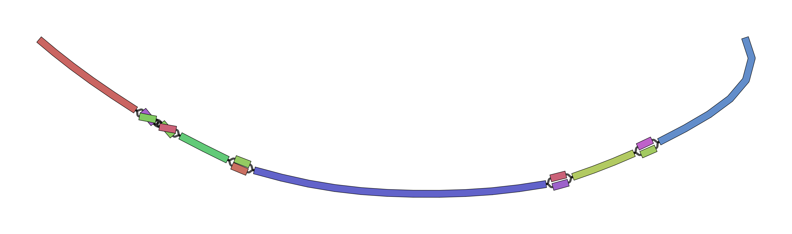
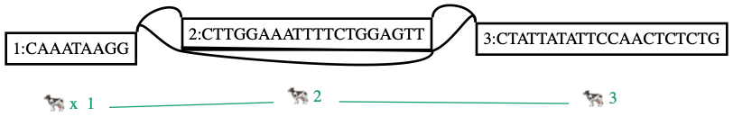
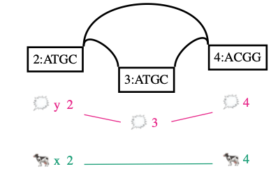

# vg construct

4日目です。今日からコマンド紹介に入っていきます。

最初に紹介するのは、配列に対する差分情報からグラフを生成する、`vg construct` です。


ターミナル上で、`vg-v1.20.0/test` ディレクトリにいることを想定して話を進めていきます(今日に限らず)。


`vg construct` からグラフを作るときの入力は

1. リファレンス配列+VCF
2. マルチプルシーケンスアラインメント(MSA)の結果

の2パターンがあります。


## 動かし方

### 入力がリファレンス配列+VCFのとき

基本形は

```shell
$ vg construct -r tiny/tiny.fa -v tiny/tiny.vcf.gz > tiny/tiny.vg
```

です。バックボーンとなる配列と、その座標系を基準としたVCF形式の差分情報が入力です。gzipで圧縮されたものもOK。VGファイルが出力されます。


```shell
$ less tiny/tiny.vg
"tiny/tiny.vg" may be a binary file.  See it anyway?
```

バイナリです。中身がわからないので、Graphvizで可視化して確認します。

```shell
$ vg view -dp tiny/tiny.vg | dot -Tpng -o tiny/tiny.png && open tiny/tiny.png
```


`vg view` の詳細は別日にやりますが、小さいグラフだったらこのようにみて確認するとよいでしょう。もう少し大きい場合は、GFAに吐いてBandageで確認します。

```shell
$ /Applications/Bandage_Mac_v0_8_1/Bandage.app/Contents/MacOS/Bandage image tiny/tiny.gfa tiny/tiny.bandage.png && open tiny/tiny.bandage.png  # GUIを立ち上げて操作する方がよいかも
```



とにかく、SNVを取り込んだグラフができていることが確認できました。


この例だけだと、SNVやsmall indelを取り込んだDAGしか作れない感じがしますが、SVもグラフとして表現することができます。

```shell
$ vg construct -r sv/x.fa -v sv/x.inv.vcf > sv/x.inv.vg
warning:[vg::Constructor] Unsupported variant allele "<INV>"; Skipping variant(s) x	9	sv1	C	<INV>	99	PASS	AC=1;CIEND=-3,0;CIPOS=0,3;END=29;NA=1;NS=1;SVTYPE=INV !
$ vg construct -S -r sv/x.fa -v sv/x.inv.vcf > sv/x.inv.vg
$ vg view -dp sv/x.inv.vg | dot -Tpng -o sv/x.inv.png && open sv/x.inv.png
```

デフォルトではSVは無視しますが、`-S` をつけることでSVもパースするようになります。可視化すると、逆位が表現できていることがわかります。




とは言え、VCFのすべての表現をパースできるのかは確認していないため、エラーが出るケースがあるのかもしれません。


### 入力がMSAのとき

2つ目のパターンはMSAを入力にする場合です。入力フォーマットは、

```
    -F, --msa-format       format of the MSA file (options: fasta, clustal; default fasta)
```

より、 fastaかclustalが選べます。Clustal OmegaやMAFFTといった汎用的なマルチプルアラインメントツールの出力結果をグラフ構築のインプットにできるということです。


いい感じのデータがないので作るところから始めます。

```shell
$ mkdir msa
$ echo -e ">x\nATGC----ACGG\n>y\nATGCATGCACGG" > msa/msa.fa
$ cat msa/msa.fa  # 確認
>x
ATGC----ACGG
>y
ATGCATGCACGG
$ vg construct -M msa/msa.fa > msa/msa.vg  # -Mでmsaをパースする
$ vg view -dp msa/msa.vg | dot -Tpng -o msa/msa.png && open msa/msa.png  # 可視化して確認
```




以上`vg construct` の紹介でした。


## 参考

* https://github.com/vgteam/vg/wiki/Construction
* https://github.com/vgteam/vg/wiki/Working-with-a-whole-genome-variation-graph
* https://github.com/vgteam/vg/wiki/SV-genotyping-with-vg

