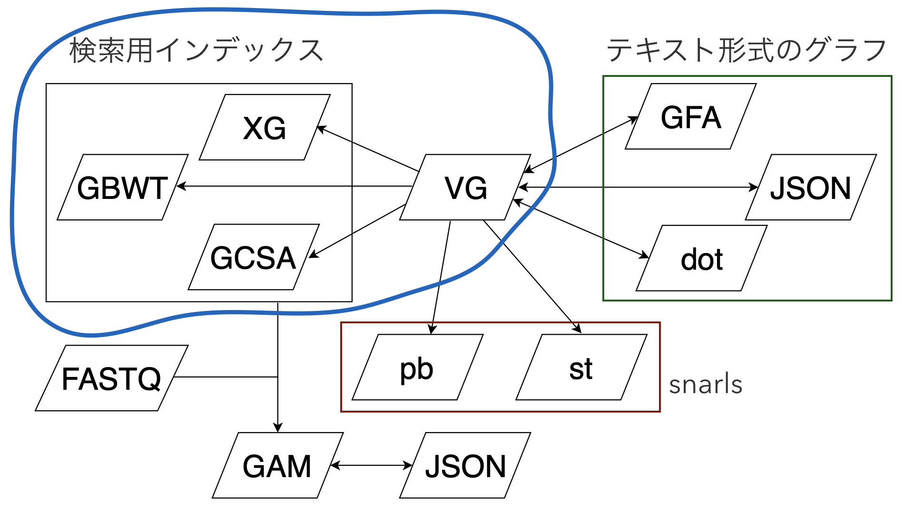
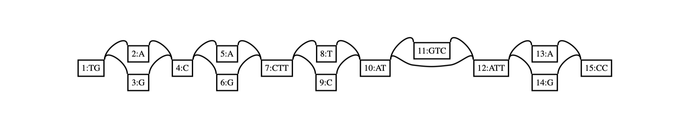

# vg index

5日目です。今日は `vg index` を紹介します。

2日目の図で言うと、青で囲んだ部分です。



## 準備

```shell
$ vg construct -r small/x.fa -v small/x.vcf.gz -a > small/x.vg
$ vg stats -lz small/x.vg
nodes	 215
edges	 296
length 1074
```

これから数日間はこのディレクトリのデータを使います。


## XG

```shell
$ vg index -x small/index.xg small/x.vg
```

標準出力ではなく、`-x` で指定したファイルに出力します。


## GCSA

```shell
$ vg index -k 16 -b . -g small/index.gcsa small/x.vg
```

`small/index.gcsa` と `small/index.gcsa.lcp` という2つのファイルができます。GCSA2の詳細は作り方は [vg内の簡潔データ構造](https://drive.google.com/open?id=1chIwlKbBIk5mAz3FwvFUbkdfKQtP7y94) のP14-24を参照してください。


#### 注意点1

実行中の中間ファイルは `TMPDIR` に生成されます。(今回は問題ないのですが) 大きいグラフだとかなりディスク容量を食うので、1. tmpファイルをどこに置くのか、2. ディスク容量の空きは大丈夫か、という2点を確認しておく必要があります。以下、[引用](https://github.com/vgteam/vg/wiki/working-with-a-whole-genome-variation-graph#indexing-with-xg-and-gcsa2)

>  **important**: The location of the temporary files created for this process is specified using the TMPDIR environment variable. Make sure it is set to a volume a couple of terabytes of free space


やっていることはグラフ中のk-merを全列挙なのですが、kに収まる範囲に小さい分岐が連続していたり、ループがたくさんあったりすると、簡単に組合せ爆発を起こして、>数百GBのRAMを消費してしまいます。この問題を解決するには、事前にグラフ中の複雑領域を"枝刈り"しておく必要があります。それをするのが、 `vg prune` コマンドで、後日紹介します。


#### 注意点2

GCSA2は実装の制約上、ノードのサイズは1024bp以下である必要があります。なので、グラフを作るときは `vg mod -X` を使って、適当な長さに切る必要があります。`vg construct` は `-m`  で設定できます。デフォルトでは32bpです。

(と思ったけど、[ノードサイズの上限を変えられるようになったらしい](https://github.com/vgteam/vg/issues/2486#issuecomment-535716178))


## GBWT

```shell
$ vg index -G small/index.gbwt -v small/x.vcf.gz small/x.vg
```

`vg prune` や `vg map` で使用します。構築手法の自体の詳細は、実は研究会ではやっていなかったことに気がついたので、資料がありません。。

GBWTをどういうときに使うかというと、例えば


という設定のときにこれをグラフ表現すると、



となります(作り方によりますが)。このグラフだけを見ると、1→2→4→6というノードを通るパスが作れてしまいます。`TGACG...`というクエリ配列があったら、このパスがトップヒットで報告されるでしょう。


しかし上のヒトたちから観測されたわけではないため、現実的には相当確率の低いパスです。このような状況では、出現確率に合わせて得られたパスのスコアに重みづけをする必要があります。そのために使われるハプロタイプのインデックスがGBWTです。


この辺の詳細は[GBWT GCSA](https://drive.google.com/file/d/1_Xp1e88_ZSZgXRKZbbvJyaw4XdHoNUpR/view?usp=sharing)を参照してください。


以上、 `vg index` の紹介でした。


## 参考

* https://github.com/vgteam/vg/wiki/Basic-Operations
* https://github.com/vgteam/vg/wiki/Index-Construction
* https://github.com/vgteam/vg/wiki/Indexing-Huge-Datasets