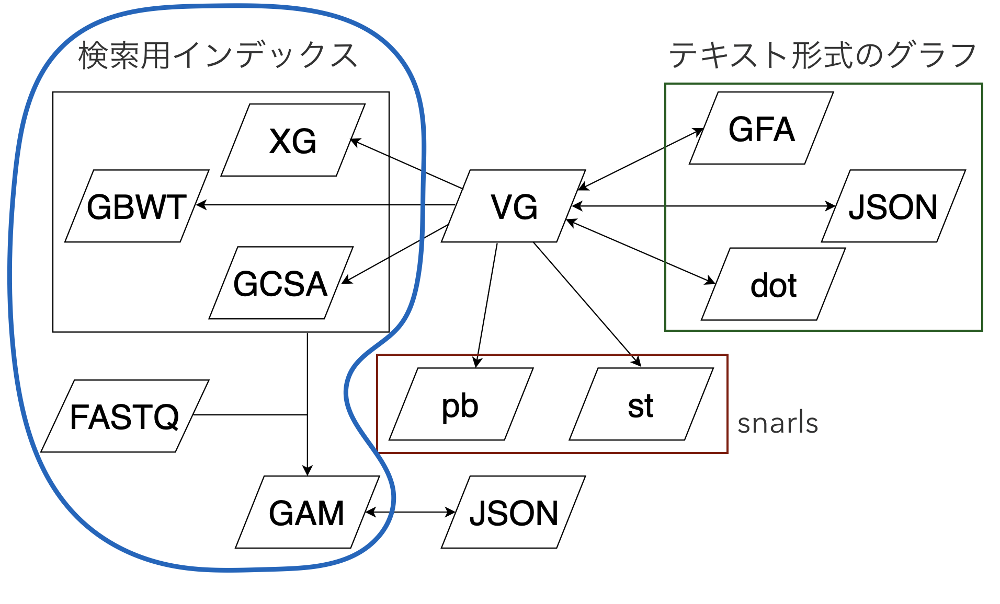

# vg map

6日目です。今日は `vg map` を紹介します。
図でいうと青で囲った部分です。




## 動かし方

GBWTなしの場合は、

```shell
$ vg map -f small/x.fa_1.fastq -f small/x.fa_2.fastq -x small/index.xg -g small/index.gcsa -t 1 > small/aln.gam
```


GBWTあり

```shell
$ vg map -f small/x.fa_1.fastq -f small/x.fa_2.fastq -x small/index.xg -g small/index.gcsa -1 small/index.gbwt -t 1 > small/aln.gbwt.gam
```

いちいち複数のインデックスを指定するのがめんどくさいとき用に `-d` があります。

```shell
$ vg map -f small/x.fa_1.fastq -f small/x.fa_2.fastq -d small/index -t 1 > small/aln.gbwt.gam  # prefixが同じなら、よしなに探してくれる
```

オプションを見ると

```
    -d, --base-name BASE          use BASE.xg and BASE.gcsa as the input index pair
```

となっていますが、[コードを見る限りGBWTもいけそう](https://github.com/vgteam/vg/blob/v1.20.0/src/subcommand/map_main.cpp#L624-L628)です。


デフォルトではショートリード用のパラメータになっています。ONTやPacBioのロングリードを使う場合は、`-m long` というプリセットを指定します。


出力されたGAMは

```shell
$ vg view -a small/aln.gam
```

でJSONにして確認できます。

アラインメント結果をフィルタリングしたい場合は、たとえば

```shell
$ vg view -a small/aln.gam | jq -cr 'select(.identity >= 0.95)' | vg view -aJG - > small/aln.95.gam
```

とすると、類似度95%未満のレコードを除いて、GAMに戻すことができます。


## アルゴリズム


> 1. MEMを計算 (それ以上拡張できない完全一致検索)
> 2. Sub MEMを計算 (長いMEMの中から短いMEM探索)
> 3. Chaining (近隣のMEMをグループ分け)してソート
> 4. 5~6を指定回数繰り返す(デフォは128)
> 5. 各クラスタから部分グラフ構築
> 6. 部分グラフに対してPOAを行う
> 7. 得られたアラインメントに対してpathのスコアを加味
> 8. アラインメントをスコア順にソートして指定数個出力

(from https://drive.google.com/file/d/1hDj_jYvNdZeHghVB-8fP1qmVrjEp0G6i/view?usp=sharing)


POAはPartial Order Alignmentのことで、グラフの分岐する領域だけDPマトリックスを別に用意して、トレースバックするときにスコアの高いパスを選ぶというアルゴリズムです。[元論文のFig4](https://academic.oup.com/bioinformatics/article/18/3/452/236691)がわかりやすいです。

どういうスコアの計算をしているのかは、以下のスライドを見るとよいかと思います。

* https://drive.google.com/file/d/1_Xp1e88_ZSZgXRKZbbvJyaw4XdHoNUpR/view?usp=sharing
* https://drive.google.com/file/d/1gj70GYrNGnvrHAjKno2w_ZgViCanwvOr/view?usp=sharing


### パスがある vs なしでのスコアの違い

https://github.com/vgteam/vg/issues/2445


## その他のアラインメントツール

* `vg mpmap`
  * ハプロタイプの出現確率も考慮にいれてアラインメントを行う
* [BrownieAligner](https://github.com/biointec/browniealigner)
  * 配列からde Bruijn graphを構築して、それをリファレンスとしたアラインメントをとる
* [GraphAligner](https://github.com/maickrau/GraphAligner)
  * ロングリード用
  * seed 探索にminimizer or MUM/MEM を使う
  * ちょっと動かした感じ高速に動作
  * `vg` でもminimizerを使うアラインメントが `vg minimizer` と `vg gaffe ` として実装されてはいる。developer commandsなので動かしたことはないですが。

