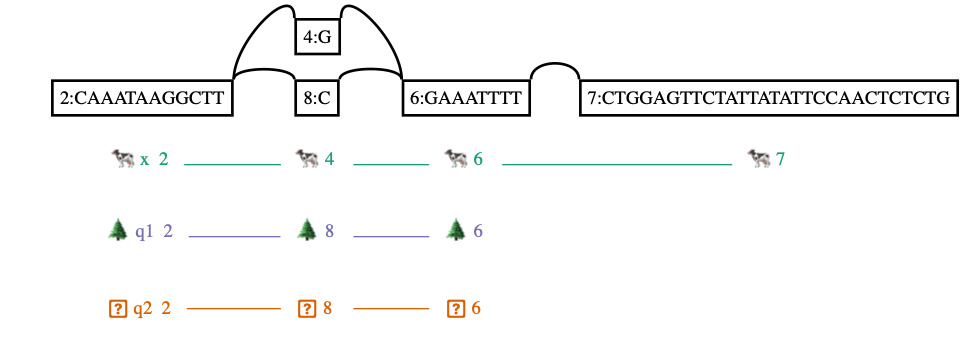
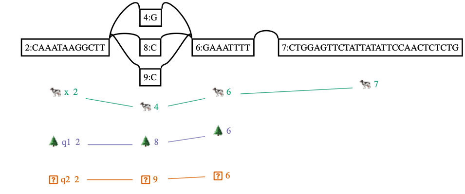

# vg augment

7日目です。今日はアラインメントの差分をグラフに取り込んでグラフを更新する `vg augment` を紹介します。


## 動かし方

使い方は

```shell
$ vg augment -C small/x.vg small/aln.gam > small/aug.vg
```

です。差分を取り込んだだけグラフのサイズが大きくなっています。

```shell
$ vg stats -lz small/x.vg
odes	215
edges	296
length	1074
$ vg stats -lz small/aug.vg
nodes	1222
edges	2143
length	1755
```


Graphvizで可視化するには大きすぎるため、Bandageでみます。

```shell
$ /Applications/Bandage_Mac_v0_8_1/Bandage.app/Contents/MacOS/Bandage load small/aug.gfa &
```


デフォルトでは差分を取り込むだけですが、`-i` フラグを立てることでクエリをパスとして埋め込むことができます。

```shell
$ vg augment -i -C small/x.vg small/aln.gam | vg view - | grep -c ^P
```


`-A` フラグを立てると、拡張したグラフ上でのアラインメントに修正したGAMもファイル出力できます。

```shell
$ vg augment -A small/aug.gam small/x.vg small/aln.gam > small/aug.vg
```


## 実験

`vg augment` を使うときの疑問として、同じ配列をもつクエリが複数あるときにグラフはどのようになるのかというのがあると思います。軽い実験をしてみます。

たとえば、

```
ref: CAAATAAGGCTTGGAAATTTTCTGGAGTTCTATTATATTCCAACTCTCTG
q1 : CAAATAAGGCTTCGAAATTTT
q2 : CAAATAAGGCTTCGAAATTTT
```

という感じに同じ配列のクエリが二本ある場合を考えてみましょう。

```shell
$ mkdir aug_norm
$ vg construct -m 50 -r tiny/tiny.fa > aug_norm/linear.vg  # VGファイルを作る
$ vg view aug_norm/linear.vg  # 線形な配列もグラフと言える
H	VN:Z:1.0
S	1	CAAATAAGGCTTGGAAATTTTCTGGAGTTCTATTATATTCCAACTCTCTG
P	x	1+	50M
$ echo -e ">q1\nCAAATAAGGCTTCGAAATTTT\n>q2\nCAAATAAGGCTTCGAAATTTT" > aug_norm/q.fa
$ cat aug_norm/q.fa
>q1
CAAATAAGGCTTCGAAATTTT
>q2
CAAATAAGGCTTCGAAATTTT
$ vg index -x aug_norm/index.xg -g aug_norm/index.gcsa aug_norm/linear.vg
$ vg map -d aug_norm/index -F aug_norm/q.fa > aug_norm/aln.gam  # XGとGCSAのprefixが同じなら -d でまとめて指定することもできる
$ vg augment -i aug_norm/linear.vg aug_norm/aln.gam | vg view -dp - | dot -Tpng -o aug_norm/aug.png && open aug_norm/aug.png  # パス付きで可視化
```




重複するノードはちゃんとマージされていることがわかります。


↓ではないということです。




以上、 `vg augment` でした。