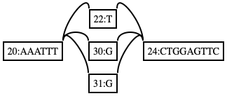
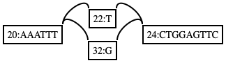

# vg mod

13日目はグラフを編集する `vg mod`  を紹介します。


オプションの多さを見ればわかるように、いろいろなことができます。実験的に使いたい操作はとりあえずここに実装しておいて、ちゃんとする必要が出てきたらサブコマンドとして分離させる、みたいな事例も時々あります。なので、他のサブコマンドと重複するようなオプションもあります。


## 動かし方

### --normalize

冗長な分岐がマージされます。

```shell
$ vg view -Fd graphs/redundant-snp.gfa | dot -T png -o graphs/redundant-snp.png # 絵で見る
$ vg view -Fv graphs/redundant-snp.gfa | vg mod -n - | vg view -d - | dot -Tpng -o graphs/redundant-snp.norm.png # normalizeする
$ open graphs/redundant-snp{.norm,}.png 
```







このオプションを使うというよりは、normalizeという用語を覚えておくことの方が重要です。


### --drop-paths

VGファイルのPathだけ落とします。

```shell
$ vg msga -f msga/w.fa > msga/x.vg
$ vg view msgas/x.vg | grep -c ^P  # もとのグラフは2本のパスをもっている
2
$ vg mod -D msgas/x.vg | vg view - | grep -c ^P
0
$ vg view msgas/x.vg | grep -v ^P | vg view -Fv - > x.non_path.vg  # やっていることはこれと同じ
```


### --remove-non-path

パスが通っていないノードを落とします。

```shell
$ vg mod -N tiny/tiny.vg | vg view -
H	VN:Z:1.0
S	1	CAAATAAG
S	15	CCAACTCTCTG
S	3	G
S	14	T
S	5	C
S	6	TTG
S	11	T
S	8	G
S	9	AAATTTTCTGGAGTTCTAT
S	12	ATAT
P	x	1+,3+,5+,6+,8+,9+,11+,12+,14+,15+	8M,1M,1M,3M,1M,19M,1M,4M,1M,11M
L	1	+	3	+	0M
L	3	+	5	+	0M
L	14	+	15	+	0M
L	5	+	6	+	0M
L	6	+	8	+	0M
L	11	+	12	+	0M
L	8	+	9	+	0M
L	9	+	11	+	0M
L	12	+	14	+	0M
```


逆の操作をする`--remove-path` というのもあります


### --chop

グラフのノードをこのオプションで指定した長さで切ります。GCSAを作る前とかに使います。

```shell
$ vg construct -m 50 -r tiny/tiny.fa | vg view -  # 使うデータ
H	VN:Z:1.0
S	1	CAAATAAGGCTTGGAAATTTTCTGGAGTTCTATTATATTCCAACTCTCTG
P	x	1+	50M
$ vg construct -m 50 -r tiny/tiny.fa | vg mod -X 12 - | vg view -  # 1ノードのmaxを12塩基とする
H	VN:Z:1.0
S	6	TG
S	2	CAAATAAGGCTT
S	3	GGAAATTTTCTG
S	4	GAGTTCTATTAT
S	5	ATTCCAACTCTC
P	x	2+,3+,4+,5+,6+	12M,12M,12M,12M,2M
L	2	+	3	+	0M
L	3	+	4	+	0M
L	4	+	5	+	0M
L	5	+	6	+	0M
```


### --unchop

`--chop` の逆で、ノード中の分岐していない領域は一つのノードとしてマージします。

```shell
$ vg construct -r tiny/tiny.fa | vg view -
H	VN:Z:1.0
S	1	CAAATAAGGCTTGGAAATTTTCTGGAGTTCTA
S	2	TTATATTCCAACTCTCTG
P	x	1+,2+	32M,18M
L	1	+	2	+	0M
$ vg construct -r tiny/tiny.fa | vg mod -u - | vg view -
H	VN:Z:1.0
S	3	CAAATAAGGCTTGGAAATTTTCTGGAGTTCTATTATATTCCAACTCTCTG
P	x	3+	50M
```


注意点としては、リニアなんだけど途中で途切れるパスがある場合はマージされないということです。パスが破壊されるような編集はできないようになっています。

```shell
$ vg construct -r tiny/tiny.fa | vg view - | gsed "$ a P\ty\t1+\t32M"  # ノード1だけをもつパスを差し込む
H	VN:Z:1.0
S	1	CAAATAAGGCTTGGAAATTTTCTGGAGTTCTA
S	2	TTATATTCCAACTCTCTG
P	x	1+,2+	32M,18M
L	1	+	2	+	0M
P	y	1+	32M
$ vg construct -r tiny/tiny.fa | vg view - | gsed "$ a P\ty\t1+\t32M" | vg view -Fv - | vg mod -u - | vg view -  # マージされない！
H	VN:Z:1.0
S	1	CAAATAAGGCTTGGAAATTTTCTGGAGTTCTA
S	2	TTATATTCCAACTCTCTG
P	x	1+,2+	32M,18M
P	y	1+	32M
L	1	+	2	+	0M
```


雑ですが、 `vg mod` の紹介を終わります。


