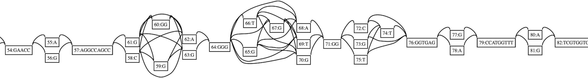

# vg prune

14日目です。折り返していたことに今気付きました。

今日は、GCSAを作る前に複雑領域の枝刈りを行う `vg prune` を紹介します。


[5日目](./12-05.md#GCSA)に少し触れたように、GCSAを作るときには大量のRAM/ディスクを消費してしまう場合があります。これを回避するために使います。どういうモチベーションで使うかは [SPAdes の出力と vg index とたたかう話](https://drive.google.com/file/d/1ryIf2aywL9mNY9Cjq8lE4pACDF_E3vF7/view?usp=sharing)の「次善の策として」のページ以降にまとまっています。なので説明は大幅にショートカット。

(ちなみに前半のbluntifyがバグっているのでは？という話は[v1.9.0で修正されました](https://github.com/vgteam/vg/pull/1765)。)


## 動かしかた

パスの有無によって、処理の仕方が異なります。ここではパスがない場合のスタンダードな使い方を紹介します。


まずは準備

```shell
$ vg construct -r complex/c.fa -v complex/c.vcf.gz > complex/complex.vg
$ vg view -d complex/complex.vg | dot -Tpng -o complex/complex.png
```

このへんとかが複雑そう。




シンプルに枝刈りしてみます。

```shell
$ vg prune complex/complex.vg > complex/complex.pruned.vg
$ vg view -d complex/complex.pruned.vg | dot -Tpng -o complex/complex.pruned.png  # ごっそり抜けている
$ vg stats -lz complex/complex.vg
nodes	83
edges	128
length	682
$ vg stats -lz complex/complex.pruned.vg  # 数字の面でも明らか
nodes	54
edges	66
length	620
```


ちなみにパスが乗っているエッジをリストアしておくと刈られる量を減らすことができます。

```shell
$ vg prune -r complex/complex.vg | vg stats -lz -
nodes	69
edges	82
length	667
```


グラフによってどんなパラメータを使うかが変わります。そのへんは珍しく[本家のWiki](https://github.com/vgteam/vg/wiki/Index-Construction#complex-graph)にまとまっているので、それを参考にすると良いと思います。

(v1.20.0用に書かれているので動くはず)


というわけで、 `vg prune` の紹介を終わります。

