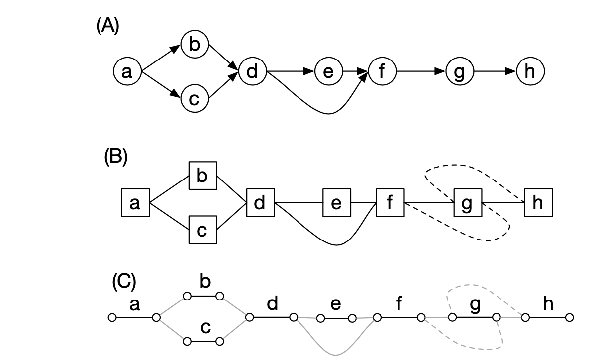
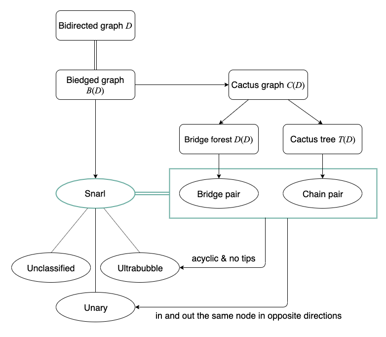
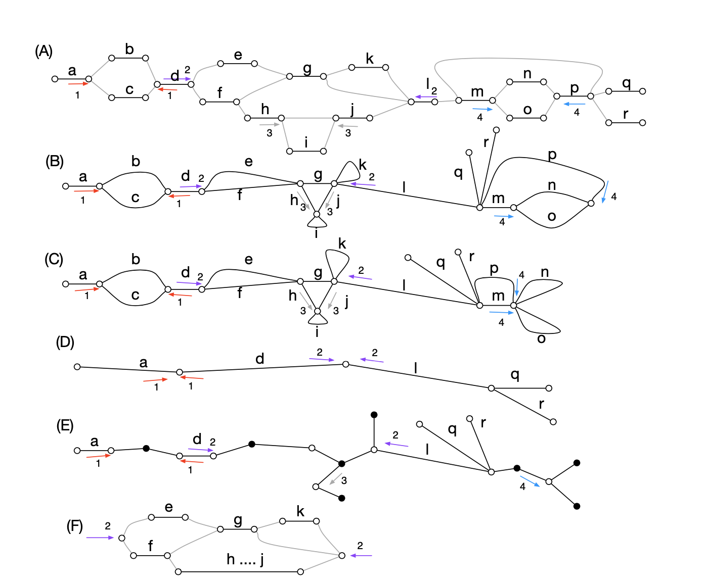
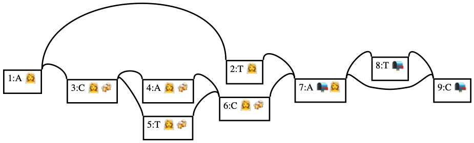
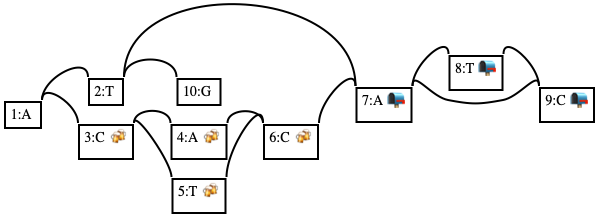
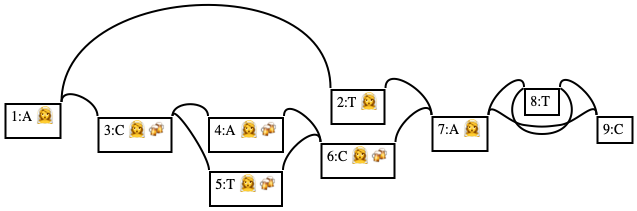
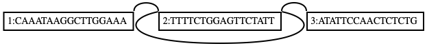
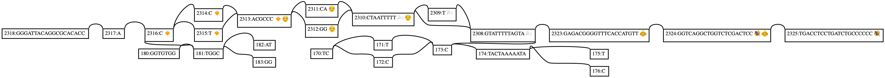

# vg snarls

NGS解析にゲノム配列ではなくわざわざゲノムグラフを使う理由は、バブル(グラフ中の分岐)をみたいから、というのが多いと思います。バブルは、たとえばゲノムアセンブルの文脈ではシーケンシングエラーやハプロタイプごとの差異を表し、パンゲノムの文脈では株間の違いを表現するようなものになるでしょう。`vg` ではこのバブルを一般化した、snarlというものを扱うことができます。


というわけで16日目は、snarlの一覧を出力する `vg snarls` というサブコマンドについて紹介します。

。。。

と思ったのですが、コマンドを使う以前に、出力結果に登場する概念が未知すぎるし、snarl周りの概念や定義は [Paten et al.](https://www.ncbi.nlm.nih.gov/pmc/articles/PMC6067107/) (以下、snarl論文と呼ぶことにします) にしかまとまってないと思うので、snarl論文の紹介が6割、`vg snarls` の紹介が4割みたいな内容になります。論文の図は、`CC-BY 4.0` である [bioRxiv版](https://www.biorxiv.org/content/10.1101/101493v1.abstract)を拝借します。

(ぶっちゃけ理解が曖昧なところが多いので、間違っていたらすいません。)


## `vg` のグラフの数学的定義

`vg` は、数学的には **bidirected graph** というグラフを採用しています。実装上はこれでいいのですが、紙の上で議論するときには煩わしいことがいくつかあるので、議論をすっきりさせるために言い換え表現として **biedged graph** というグラフをsnarl論文では導入しています。ここでは、まずこの2つのグラフの定義を確認します。


### Bidirected graph

Bidirected graph とは、ノード中にエッジの出入り口が1つではなく、2つあるようなグラフのことです。正確な定義は、snarl論文を引用すると

> A bidirected graph $D=(V_D,E_D)$ is a graph in which each endpoint of every edge has an independent orientation (denoted either "left" or "right"), indicating if the endpoint is incident with the left or right side of the given vertex.

です。


2日目に紹介したVGフォーマットでは、 `Edge` が

```protobuf
message Edge {
    int64 from = 1;
    int64 to = 2;
    bool from_start = 3;
    bool to_end = 4;
    int32 overlap = 5;
}
```

という風になっていたのを思い出せばわかるように、 `from_start` と `to_end` という2つのbool値で実現してます。


### Biedged graph

ノードの左とか右を考えないといけないのは少し煩わしいです。そこで、bidirected graphと数学的に同値な別のグラフを導入することにします。

Bidirected graph上のノードを左と右に分割して、それを頂点と見なし、左と右の間にエッジを張り、black edgeと呼ぶことにします。Bidirected graphにおいてエッジであったものは、gray edgeという色をつけることにします。このようにノードの左右のエッジを頂点としたグラフのことを **biedged graph** と呼びます。正確な定義は、snarl論文を引用すると

> A biedged graph is a graph with two types of edges: black edges and grey edges, such that each vertex is incident with at most one black edge

です。Directed graph, bidirected graph, biedged graphを絵に表すと、



のようになります(snarl論文のfig1より)。


Bidirected graphとbiedged graphは数学的に同値なので、今後はbiedged graphを議論に用いることにします。


## Snarl

### Snarlの定義

Snarl論文における定義は

> In a biedged graph $B(D)$, a pair set of distinct, non-opposite vertices $\{x‚ y\}$ are a snarl (Fig. 2B) if:
>
> - separable: The removal of the black edges incident with x and y disconnects the graph, creating a separated component $X$ containing $x$ and $y$ and not $\hat{x}$ and $\hat{y}$.
> - minimality: No pair of opposites $\{z‚\hat{z}\}$ in $X$ exists such that $\{x‚z\}$ and $\{y‚\hat{z}\}$ fulfills the criteria described earlier.

となっています。

記号の確認。 $x$ はbiedged graphの頂点を表し、

| $x$              | $\hat{x}$        |
| :---------------- | :---------------- |
| (node ID, left)  | (node ID, right) |
| (node ID, right) | (node ID, left)  |

 の関係にあります。$X$ はサブグラフ。


定義を言い換えると

* グラフを適当なところで切り取って、サブグラフを作る
* そのサブグラフのどのノードを開始点として"外に出る"ようにしても、必ずある2頂点のいずれかの出入り口を通らないといけない

という条件を満たすとき、この出入り口のことをsnarlと定義する、といった感じになるのでしょうか。


たとえば、上の図の(B)のbidirected graph で、ノードbとcは"外に出る"には必ずaかdを通る必要があります。なので、{(a, r), (d, l)} はsnarlとなります。この後、 `vg snarl` を動かしながら確認します。


**注**：`vg` の実装では、ノードIDが同じ場合にはunaryという種類のsnarlがあるのですが、これはSnarl論文での定義でノードIDが違うことを要求しているのとは矛盾しているように感じます。`vg` のソースコード中にsnarlの定義が書いてある場所を見つけられず。


### Snarlのサブタイプ

Snarl論文ではultrabubbleしか出てきませんが、`vg` の実装上は[3つのタイプに分類されています](https://github.com/vgteam/libvgio/blob/7d539bd/deps/vg.proto#L235-L240)。

```protobuf
enum SnarlType {
  UNCLASSIFIED = 0;
  ULTRABUBBLE = 1;
  UNARY = 2;
}
```


#### Ultrabubble

Snarlのうち、

> In a biedged graph B(D), a snarl is an ultrabubble if its separated component is acyclic and contains no tips.

であるものをultrabubbleと呼びます。Directed graphのsuperbubbleに相当するものです。一番イメージしやすい。ここで出てくるtipsは

> We call a vertex not incident with a grey edge a tip

の通り、分岐したのにどこにも合流しないノードの接続していない頂点を指します(Velvetの論文が最初っぽい)。


#### Unary

Unaryはそもそもsnarl論文にすら登場しませんが、[ソースコード上](https://github.com/vgteam/vg/blob/v1.20.0/src/snarls.cpp#L1580)では

> Make sure it is properly specified to be unary (in and out the same node in opposite directions)

とあり、これがunaryの定義だと思われます。ただ、snarl論文の定義と合わないので、よくわからないです。


そんなこんなで、[unaryに関する処遇の話](https://github.com/vgteam/vg/issues/2526)も出ています。


#### Unclussified

いずれにも分類されないもの。


## Snarl列挙の戦略

グラフとSnarlの定義は以上なのですが、実際にグラフを与えてsnarlを探すにはもう少し工夫が必要です。Ssnarl論文で説明されているsnarl列挙の方法は `2. Methods` の `2.4-2.7` にまとまっています。


すごくざっくり図にまとめると以下のようになります。



流れは、

1. Biedged graph を [cactus graph]([https://ja.wikipedia.org/wiki/%E3%82%AB%E3%82%AF%E3%82%BF%E3%82%B9%E3%82%B0%E3%83%A9%E3%83%95](https://ja.wikipedia.org/wiki/カクタスグラフ)) を経由して、bridge forest と cactus tree にそれぞれ変換する
2. Bridge forest から bridge pair を、cactus tree から chain pair を計算する
3. Bridge pair と chain pair のうち重複を除いて、compatible snarl familyにする (ここがめちゃくちゃ怪しい)
4. Compatible snarl family とそれによって構成されるサブグラフをチェックして、ultrabubble/unary/unclassified へと分類する。

という感じでしょうか。先ほどから何度も言い訳していますが、snarl論文では、ultrabubbleの話しか出てこないので、実装がどうなっているのかはちゃんとソースコードを読まないといけない感じがします。すいません。。


* (A) biedged graph (1,2,3,4がsnarl)
* (C) cactus graph
* (D) bridge forest (1, 2がbridge pair)
* (E) cactus tree (1,2,3,4がchain pair)




## Snarlフォーマット

Snarlの出力形式は、[Protobuf中](https://github.com/vgteam/libvgio/blob/7d539bd/deps/vg.proto#L242-L268)で定義されています。


```protobuf
message Snarl {
    SnarlType type = 1;

    Visit start = 2; // 実質ノードID
    Visit end = 3;   // 実質ノードID

    Snarl parent = 4;  // 入れ子になっている場合

    string name = 5;

    bool start_self_reachable = 6; // 自分に戻ってくる
    bool end_self_reachable = 7;

    bool start_end_reachable = 8; // 繋がっている的な

    bool directed_acyclic_net_graph = 9;  // DAGかどうか
}
```


## `vg snarls` を動かす

準備が長くなりましたが、実際に、`vg snarls` を動かして出力を見てみましょう。

### シンプルなultrabubbleの例
Snarlのテストケース用のグラフ`snarls/snarls.json` を利用します。まずはどんなグラフなのか可視化して確認しましょう。

```shell
$ vg view -JdY snarls/snarls.json | dot -Tpng -o snarls/snarls.png && open snarls/snarls.png
```



JSONを読んで、VGとして出力したあと、`vg snarls` でsnarlの一覧を出力します。dotファイルを吐くときに`Y`フラグを立てておくと、ultrabubbleのノードを絵文字でマーキングします。
この例だと、

* {(1, right), (7, left)}
* {(3, right), (6, left)}
* {(7, right), (9, left)}

 がultrabubbleです。{(1, right), (7, left)} で切り取られるサブグラフの中に {(3, right), (6, left)} が入っている入れ子構造になっています。

このようなグラフに対して `vg snarls` を実行してみましょう。デフォルトでsnarlのprotobufを出力するので、 `vg view -R` でJSONに変換します。

```shell
$ vg view -Jv snarls/snarls.json | vg snarls - | vg view -R - | jq
{
  "directed_acyclic_net_graph": true,
  "end": {
    "node_id": "7"
  },
  "start": {
    "node_id": "1"
  },
  "start_end_reachable": true,
  "type": 1
}
{
  "directed_acyclic_net_graph": true,
  "end": {
    "node_id": "6"
  },
  "parent": {
    "end": {
      "node_id": "7"
    },
    "start": {
      "node_id": "1"
    }
  },
  "start": {
    "node_id": "3"
  },
  "start_end_reachable": true,
  "type": 1
}
{
  "directed_acyclic_net_graph": true,
  "end": {
    "node_id": "9"
  },
  "start": {
    "node_id": "7"
  },
  "start_end_reachable": true,
  "type": 1
}
```

`type` に書かれているのが、snarlの種類のenum値です。1はultrabubbleを表しています。3つのsnarlがあると判定され、そのうち2番目のsnarlは入れ子になっていることも読み取れます。


`-r` でファイルを指定すると、ultrabubbles で切り取られたサブグラフで考えられるパスを列挙します。

```shell
$ vg view -Jv snarls/snarls.json | vg snarls -r snarls/ultrabubbles.ts - > /dev/null
$ vg view -E snarls/ultrabubbles.ts
{"visit": [{"node_id": "1"}, {"node_id": "3"}, {"snarl": {"end": {"node_id": "6"}, "start": {"node_id": "3"}}}, {"node_id": "6"}, {"node_id": "7"}]}
{"visit": [{"node_id": "1"}, {"node_id": "2"}, {"node_id": "7"}]}
{"visit": [{"node_id": "3"}, {"node_id": "5"}, {"node_id": "6"}]}
{"visit": [{"node_id": "3"}, {"node_id": "4"}, {"node_id": "6"}]}
{"visit": [{"node_id": "7"}, {"node_id": "9"}]}
{"visit": [{"node_id": "7"}, {"node_id": "8"}, {"node_id": "9"}]}
```


### 実験

Ultrabubbleの定義を確認するために、cycleやtipsを入れ込んで挙動をみましょう。

#### Tipsを入れてみる

ノード2にノード10のtipを入れてみます。すると、{(1, right), (7, left)} はsnarlではあるけど、ultrabubbleではなくなります。

```shell
$ vg view -J snarls/snarls.json | gsed "$ a L\t2\t+\t10\t+\t0M\nS\t10\tG" | vg view -Fv - | vg snarls - | vg view -R - | jq 'select(.type != 1)'
{
  "directed_acyclic_net_graph": true,
  "end": {
    "node_id": "7"
  },
  "start": {
    "node_id": "1"
  },
  "start_end_reachable": true
}
$ vg view -J snarls/snarls.json | gsed "$ a L\t2\t+\t10\t+\t0M\nS\t10\tG" | vg view -FdY - | dot -Tpng -o snarls/tips.png && open snarls/tips.png
```



#### 自己回帰ループを入れてみる

ノード8に自己回帰ループを入れてみます。

```shell
$ vg view -J snarls/snarls.json | gsed "$ a L\t8\t+\t8\t+\t0M" | vg view -Fv - | vg snarls - | vg view -R - | jq 'select(.type != 1)'
{
  "end": {
    "node_id": "9"
  },
  "start": {
    "node_id": "7"
  },
  "start_end_reachable": true
}
$ vg view -J snarls/snarls.json | gsed "$ a L\t8\t+\t8\t+\t0M" | vg view -FdY - | dot -Tpng -o snarls/self.png && open snarls/self.png
```




#### ループ

タンデムリピートっぽいものをいれてみて挙動をみます。

```shell
$ vg construct -m 17 -r tiny/tiny.fa | vg view -  # 元のグラフ
H	VN:Z:1.0
S	1	CAAATAAGGCTTGGAAA
S	2	TTTTCTGGAGTTCTATT
S	3	ATATTCCAACTCTCTG
P	x	1+,2+,3+	17M,17M,16M
L	1	+	2	+	0M
L	2	+	3	+	0M
$ vg construct -m 17 -r tiny/tiny.fa | vg view - | gsed "$ a L\t2\t+\t2\t+\t0M" | vg view -Fv - | vg snarls - | vg view -R - | jq
{
  "end": {
    "node_id": "3"
  },
  "start": {
    "node_id": "1"
  },
  "start_end_reachable": true
}
$ vg construct -m 17 -r tiny/tiny.fa | vg view - | gsed "$ a L\t2\t+\t2\t+\t0M" | vg view -FdY - | dot -T png -o tiny/tandem.png && open tiny/tandem.png
```

ループが始まる前後が unclassified の snarl として報告されます。




### 少し複雑な場合

続いてもう少し複雑なケースについて考えてみましょう。

```shell
$ vg view -dY inverting/m.vg | dot -T png -o inverting/m.png && open inverting/m.png
```




```shell
$ vg snarls inverting/m.vg | vg view -R - > inverting/m.snarls.json
```


#### Unary

StartとendのノードIDが同じ場合はunaryになります(これがsnarlの定義と合わない)。

```shell
$ cat inverting/m.snarls.json | jq 'select(.type = 2)'
{
  "directed_acyclic_net_graph": true,
  "end": {
    "node_id": "2317"
  },
  "parent": {
    "end": {
      "node_id": "2316"
    },
    "start": {
      "backward": true,
      "node_id": "181"
    }
  },
  "start": {
    "backward": true,
    "node_id": "2317"
  },
  "type": 2
}
{
  "directed_acyclic_net_graph": true,
  "end": {
    "node_id": "173"
  },
  "parent": {
    "end": {
      "node_id": "2323"
    },
    "start": {
      "node_id": "2308"
    }
  },
  "start": {
    "backward": true,
    "node_id": "173"
  },
  "type": 2
}
{
  "directed_acyclic_net_graph": true,
  "end": {
    "backward": true,
    "node_id": "174"
  },
  "parent": {
    "end": {
      "node_id": "2323"
    },
    "start": {
      "node_id": "2308"
    }
  },
  "start": {
    "node_id": "174"
  },
  "type": 2
}
```


以上、`vg snarls` でした。
