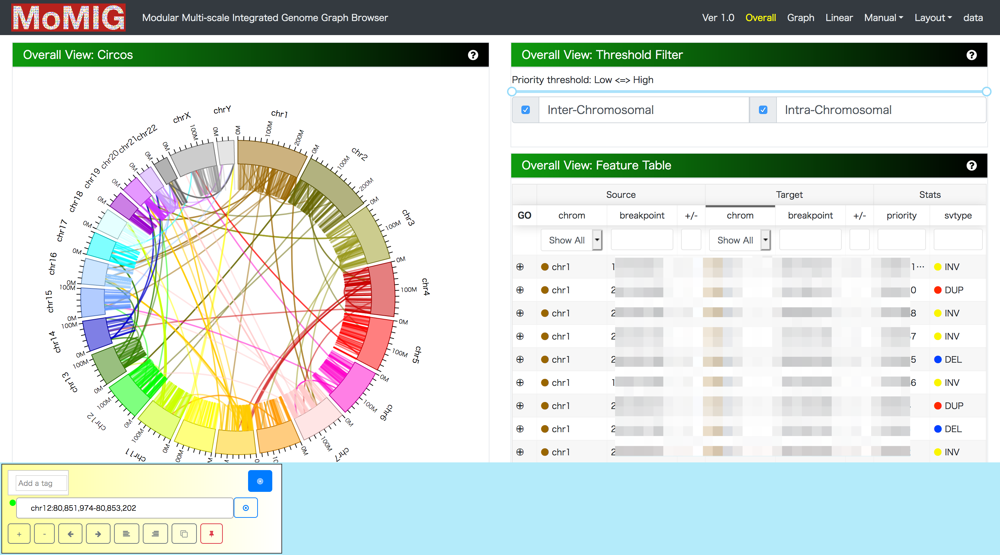

# 可視化

20日目です。またも助っ人が登場しました。可視化は vg だけで完結しないので、別枠で紹介しようと思います。グラフ可視化の方法は `vg view -d` , `vg viz` , Bandage, SequenceTubeMap とかもありますが、ここではロングリードのSVを可視化を目的とした[MoMI-G](https://github.com/MoMI-G/MoMI-G) を使ってみます。SV可視化に使えそうなその他のツールは[レビュー論文](https://twitter.com/mkasahara/status/1191620777247854592)がありますのでそちらをご参照下さい。

それでは、MoMI-G の利用方法を step-by-step でみていきましょう。MoMI-G は、ロングリードからコールされた構造異常を可視化するためのツールです。ここでは、手元に Unix のマシンと、可視化したいゲノムからバリアント・コールされた vcf ファイルがあるときに、それを MoMI-G で可視化する方法について説明します。

MoMI-G は、バックエンドとフロントエンドによって構成されています。以下の手順で、実際にデータを可視化する手順を試してみましょう。

1. 可視化したい vcf ファイルを用意する（下準備）。
2. vcfファイルを MoMI-G の入力形式に変換する。
3. MoMI-G backend で、グラフファイルをサーブできるようにする。
4. MoMI-G frontend を実行して、グラフファイルをウェブブラウザで可視化する。

## 必要な環境

* npm / yarn (npm install -g yarn)
* Docker
* Ruby (>=2.4.0)
* git
* bash
* samtools
* vg

また、vgの実行を行うことになるので、恐らくノートパソコンなどの手元のマシンで下記のパイプラインを全て実行することは難しいと考えられます。メモリを十分に積んだマシンで実行を試してください。

## 可視化したいvcfファイルを用意する（下準備）

まずは、あるゲノムをシーケンシングして得られたロングリードから vcf フォーマットを得ます。vcf フォーマットは、構造異常を列挙するデファクト・スタンダードなフォーマットです。 どのような方法を用いてもよいのですが、留意することは、現状でMoMI-G が対応しているのは、 [Sniffles](https://github.com/fritzsedlazeck/Sniffles) ないし、 [SURVIVOR](https://github.com/fritzsedlazeck/SURVIVOR) が出力するデータフォーマットです。SURVIVOR は様々なSVコーラーの出力をマージすることができるので、他のロングリード向けのSVコーラーも potentially に対応しています。また厳密にはロングリードではありませんが、10X LongRanger 由来の vcf を入力として扱うこともできます。

ここでは、ロングリードの入力に対して、 minimap2 + Sniffles のパイプラインを試してみましょう。Sniffles は、マッピング結果の BAM ファイルのそれぞれのアラインメントに、MDタグを付与することを要請しています。BAMファイルに対して、後からMDタグを計算によって求めることもできますが、ここでは、minimap2を実行する際に `--MD` オプションを付与して実行することにします。

```bash
$ minimap2 $ref $query --MD -a -t 12
```

こうすると、標準出力に　sam フォーマットでアラインメント結果が出力されます。これを bam フォーマットに変換し、ソートしてから Snifflesの入力に与えます。

```bash
$ sniffles -t 12 -m sorted.bam --report_seq -v data.vcf --genotype
```

これで、入力となるvcfファイルを生成することができました。ここのデータを用意するのが難しい場合は、 [SK-BR-3](http://schatz-lab.org/publications/SKBR3/) のBAMファイルやvcfファイルをこちらで入手することができます。

## vcfファイルをMoMI-Gの入力形式に変換する

それでは次に、そのvcf ファイルを可視化してみましょう。今、データディレクトリに以下のファイルがあるとします。

* /data/data.vcf

```bash
$ git clone https://github.com/MoMI-G/MoMI-G
$ cd MoMI-G
```

この時、MoMI-Gで可視化できるようにするために、データをグラフ形式に変換する必要があります。そのためのスクリプト群が、MoMI-G tools です。vcfフォーマットから、SVの情報を抽出します。参照配列をhg38としてマッピングして得られたデータの場合は、参照配列を hg38 とします。
また、そのデータを他のデータと識別するためのUUIDを振りましょう。今回はそのデータ名を、暫定的に`data`としておきました。

```bash
$ bash scripts/vcf2xg.sh /data/data.vcf data /usr/bin/vg hg38
```

UCSC のサーバーからダウンロードできるのhg19またはhg38を使っている場合は、最後の引数に hg19 ないし hg38 を指定することで、ダウンロードを自動的に行ってくれます。
これには、使っているvgのバージョンやマシンスペックにもよりますが、数十分〜一時間強かかります。その後、ディレクトリ直下に `data.pcf` と `data.xg` という2つのファイルが生成されます。

一方で、SK-BR-3のデータを使う場合は、リードアラインメントの際のリファレンス配列として hs37d5 のデータを利用しているため、参照配列をダウンロードする必要があります。MoMI-G tools は、リファレンス配列を既定のもの以外に取り替えることができます。そのためには、以下の作業を実行して下さい。

```bash
$ wget http://labshare.cshl.edu/shares/schatzlab/www-data/skbr3/reads_lr_skbr3.fa_ngmlr-0.2.3_mapped.bam.sniffles1kb_auto_l8_s5_noalt.vcf.gz
$ gunzip reads_lr_skbr3.fa_ngmlr-0.2.3_mapped.bam.sniffles1kb_auto_l8_s5_noalt.vcf.gz
$ wget ftp://ftp.1000genomes.ebi.ac.uk/vol1/ftp/technical/reference/phase2_reference_assembly_sequence/hs37d5.fa.gz
$ gunzip hs37d5.fa.gz
# vcf2xg スクリプトを実行します。
$ bash scripts/vcf2xg.sh reads_lr_skbr3.fa_ngmlr-0.2.3_mapped.bam.sniffles1kb_auto_l8_s5_noalt.vcf skbr3 /usr/bin/vg hs37d5.fa.gz
```

## MoMI-G backend の設定

次に、これらのデータをバックエンドに流し込むことを行います。
MoMI-G backend は docker で動作させることができるので、ビルドする必要はありませんが、MoMI-G backend に載せるためのコンフィグファイルを定義する必要があります。

```config.yaml
bin:
  vg: "vg"
  vg_tmp: "vg"
  vg_volume_prefix: ""
  graphviz: "dot"
  fa22bit: "faToTwoBit"
  bigbed: "bedToBigBed"
reference:
  chroms: "static/GRCh.json"
  data:
    - name: "hg19"
      features:
        - name: 'gene_annotation'
          url: "static/gencode.v27lift37.basic.annotation.gff3"
          chr_prefix: "chr"
    - name: "hg38"
      features:
        - name: 'gene_annotation'
          url: "static/gencode.v27.basic.annotation.gff3"
          chr_prefix: "chr"
data:
  - name: "data"
    desc: "2019/12/19"
    chr_prefix: "chr" # 使用した参照配列では、染色体名がchrから始まる文字列かどうかをここに記載。
    ref_id: "hg38"
    source:
      xg: "static/data.xg" # 書き換えるべき部分
      csv: "static/data.pcf" # 書き換えるべき部分
#      gam: "static/b.gam"
#      gamindex: "static/b.gam.index"
    features: []
    static_files: []
```

これを、static ディレクトリ直下の `static/config.yaml` に記述します。

```bash
$ mkdir static
$ mv /your-data/data.xg static/
$ mv /your-data/data.pcf static/
$ touch static/config.yaml
```

すると、 `static` ディレクトリ以下には、`data.xg` 、 `data.pcf`、 `config.yaml` が置いてあることになります。この状況で、Dockerを実行します。このとき注意してほしいのは、今回xgファイルを生成したvgのバージョンと同一のものを、バックエンドでも必要となるので、Dockerfileをそれに応じて書き換える必要があります。`Dockerfile.backend` を書き換えてみましょう。

```Dockerfile
# 下記を、MoMI-G tools で利用した vg のバージョンに変更する。
FROM quay.io/vgteam/vg:v1.20.0 as build  

# frontend container
FROM momigteam/momig-backend

COPY --from=build /vg/bin/vg /vg/bin/
# 下記の3つのファイルを、staticに移動する。
COPY static/data.xg /vg/static/
COPY static/data.pcf /vg/static/
COPY static/config.yaml /vg/static/
EXPOSE 8081

CMD ["./graph-genome-browser-backend", "--config=static/config.yaml", "--interval=1500000", "--http=0.0.0.0:8081", "--api=/api/v2/"]
```

```bash
$ docker build -t momig-custom-backend -f Dockerfile.backend .
$ docker run --init -p 8081:8081 momig-custom-backend
```

こうすると、 http://localhost:8081 でバックエンドが立ち上がります。

## MoMI-G frontend の設定

では次に同じマシン上で、MoMI-G frontend も同様に実行してみましょう。まず、フロントエンドはデフォルトでは公開サーバをバックエンドとして指定しているため、そのままではローカルに立てたサーバの情報を参照することができない。そのため、先ほどのコマンドで立ち上げた Docker によるバックエンドをさすように変更する必要があります。

```bash
$ sed -e "s/\"target/\"target_/g"  -e "s/\_target/target/g" -e "s/localhost/127.0.0.1/g" -i.bak package.json
```

この後で、yarnでフロントエンドを起動します。

```bash
$ yarn
$ yarn start
```

`http://localhost:3000` にアクセスしてみましょう。MoMI-G が起動できていることが、確認できると思います。お疲れ様でした。



適宜、不明点等あれば、こちらの[ドキュメント](https://momi-g.readthedocs.io/en/latest/) もご参照下さい。エラー報告やプルリク等々、 [GitHub](https://github.com/MoMI-G/MoMI-G) でお待ちしております。開発者も絶賛大募集です。

## References

* Yokoyama TT, Sakamoto Y, Seki M, Suzuki Y, Kasahara M. MoMI-G: modular multi-scale integrated genome graph browser. BMC Bioinformatics. 2019;20:548.
* Yokoyama TT, Kasahara M. Visualization tools for human structural variations identified by whole-genome sequencing. Journal of Human Genetics. 2020;65:49-60.
