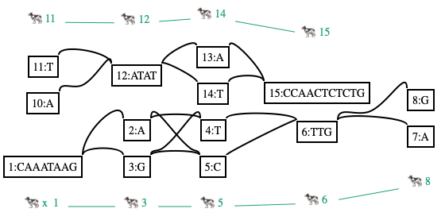

# vg explode

21日目です。今日はグラフを連結成分ごとにファイル分割する `vg explode` を紹介します。


## 動かしかた

データを作るところから。いつも使う `tiny/tiny.vg` の確認。

```shell
$ vg snarls tiny/tiny.vg | vg view -R -
{"directed_acyclic_net_graph": true, "end": {"node_id": "6"}, "start": {"node_id": "1"}, "start_end_reachable": true, "type": 1}
{"directed_acyclic_net_graph": true, "end": {"node_id": "9"}, "start": {"node_id": "6"}, "start_end_reachable": true, "type": 1}
{"directed_acyclic_net_graph": true, "end": {"node_id": "12"}, "start": {"node_id": "9"}, "start_end_reachable": true, "type": 1}
{"directed_acyclic_net_graph": true, "end": {"node_id": "15"}, "start": {"node_id": "12"}, "start_end_reachable": true, "type": 1}
```

Snarlが4ペアあります。そこで真ん中らへんのノード9を落としてみます。

```shell
$ mkdir explode
$ vg mod -y 9 tiny/tiny.vg > explode/tiny.split.vg  # ノードだけでなく、関連するエッジやパスも削除される
$ vg view -dp explode/tiny.split.vg | dot -Tpng -o explode/tiny.split.png && open explode/tiny.split.png
```




2つのグラフに分割されました。連結成分ごとにファイルにしましょう。

```shell
$ vg explode explode/tiny.split.vg explode/components
explode/components/component0.vg	x
explode/components/component1.vg	x
$ ls -1 explode/components  # 2つのグラフファイルができている
component0.vg
component1.vg
$ vg stats -lz explode/components/component0.vg
nodes	8
edges	10
length	17
$ vg stats -lz explode/components/component1.vg
nodes	6
edges	6
length	19
```


`vg explode` でファイル分割したあとに、それぞれのグラフに対して `vg stats` をするのに使ったりします。


以上、 `vg explode` でした。