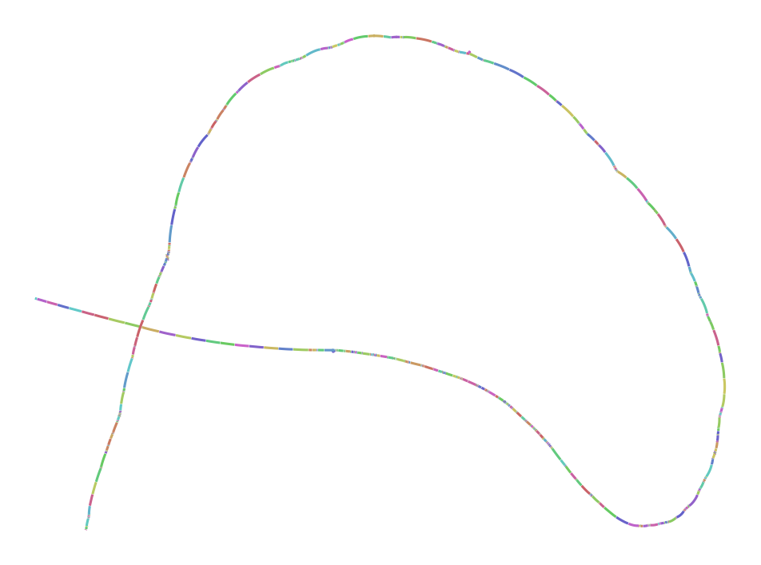
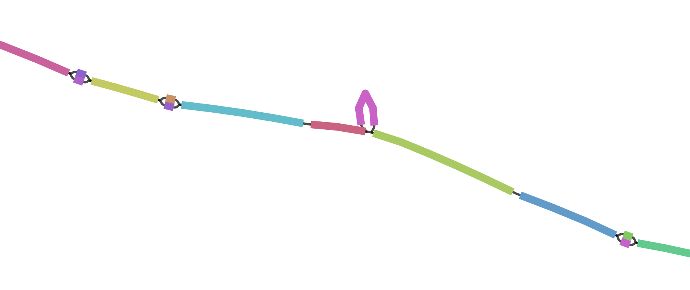

# vg msga

23日目です。今日は、アラインメントからグラフを作る `vg msga` を紹介します。


## 動かしかた

入力はFASTA形式の配列(とVG)です。

```bash
$ vg msga -f GRCh38_alts/FASTA/HLA/B-3106.fa > GRCh38_alts/FASTA/HLA/B-3106.vg
```

faiがない場合は自動で生成されます。ある場合はそれを使うので、faとfaiが異なっていないかを確認する必要があります。


グラフになっているかどうか確認しましょう。

```shell
$ seqkit stats GRCh38_alts/FASTA/HLA/B-3106.fa
file                             format  type  num_seqs  sum_len  min_len  avg_len  max_len
GRCh38_alts/FASTA/HLA/B-3106.fa  FASTA   DNA          9   30,751    3,340  3,416.8    3,975
$ vg stats -lz GRCh38_alts/FASTA/HLA/B-3106.vg
nodes	599
edges	773
length	4178
$ /Applications/Bandage_Mac_v0_8_1/Bandage.app/Contents/MacOS/Bandage load GRCh38_alts/FASTA/HLA/B-3106.gfa &  # Graphvizするには大きすぎる
```


全体像




ズームしてみるとグラフになっていることがわかります。




## 手法の概要

1. 入力配列を長い順にソートする (`--fasta-order` を指定するとそのままの順番で使う)
2. 最初の配列をグラフに変換する (`--graph` でグラフを指定している場合はそれを使う)
3. 次の配列をグラフに対してPOAする
4. 差分をaugmentする
5. これを順番に繰り返して、グラフを拡張する


## 他のツール

`vg msga` 以外にもアラインメントベースでグラフを作るツールやコマンドがあります。

* [MiniGraph](https://github.com/lh3/minigraph)
  * 2日目にちょっと登場
  * 配列を1本ずつアラインメント→augmentを繰り返す。 `vg msga` に似ているといえば似ている。
* [seqwish](https://github.com/ekg/seqwish)
  * すくいっしゅ
  * all-pairのアラインメント情報を用いて、OLCっぽい感じにレイアウトを決めて、グラフにする


以上で、 `vg msga` の紹介を終わります。

