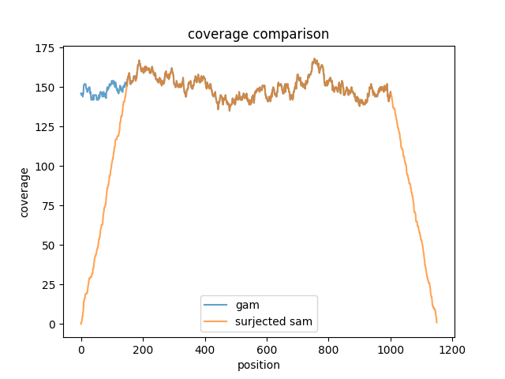

# vg circularize/surject

24日目です。今日はゲノムを環状にする`vg circularize` を紹介します。また、おまけでGAMで表されたアラインメントをSAM/BAMの線形表現に落とす `vg surject` も紹介します。

## 動かしかた

まずは、配列をVG形式に変換します。

```shell
$ mkdir circle
$ vg construct -r small/x.fa > circle/x.vg
$ vg stats -A circle/x.vg  # 1本の配列をグラフにしているだけなので、閉路はない
acyclic
$ vg view circle/x.vg | grep ^L | grep -w 32  # 一番最後のノードにつながっているノードを確認
L	31	+	32	+	0M
$ vg view -j circle/x.vg | jq '.path[].is_circular'  # JSONでPathフィールドを確認
null
```

`vg circularize` は指定したパスの最初のノードと最後のノードを繋ぐことで丸くします。(ノードを指定する場合は、ヘッドノードとテールノードを繋ぎます。)

```shell
$ vg circularize -p x circle/x.vg > circle/circle.vg
$ vg view circle/circle.vg | grep ^L | grep -w 32
L	32	+	1	+	0M  # これが今回追加された
L	31	+	32	+	0M
$ vg stats -A circle/circle.vg  # 当然閉路だと判定される
cyclic
$ vg view -j circle/circle.vg | jq '.path[].is_circular'  # JSONで確認すると値が入っていることがわかる
true
```

続いてアラインメントをします。リードは丸くしたリファレンスからシミュレートします。

```shell
$ vg index -x circle/circle.xg -g circle/circle.gcsa circle/circle.vg
$ vg sim -f -x circle/circle.xg -l 150 -n 1000 -a | vg view -X - > circle/reads.fq
$ vg map -f circle/reads.fq -d circle/circle > circle/circle.aln.gam
$ vg pack -x circle/circle.xg -g circle/circle.aln.gam -d > circle/circle.cov.tsv
```

シミュレーションのときに特にパラメータは指定していないので、カバレッジはだいたい150になっているはずです。グラフとして扱うことで、配列の端っこ付近もバイアスなくアラインメントすることができていることがわかります。

## おまけ：surjectによる線形表現

パス `x` について `vg surject` で線形表現に落とした場合と比較します。

```shell
$ vg surject -s -x circle/circle.xg circle/circle.aln.gam > circle/circle.aln.sam
$ samtools sort circle/circle.aln.sam | samtools depth -aa - > circle/linear.cov.tsv
```

カバレッジを可視化して確認しましょう。



リードもリファレンスもパラメータも同じなので、端以外はカバレッジは重なっています。
両端付近はsurjectされた方は、ガクッと落ちていることがわかります。
さらに座標をよく見ると、1001までしかないはずなのに、それ以降まで延長されてしまっています。
普通に線形でアラインメントしていればソフトクリップになるところが、環状では完全マッチで報告されるがゆえに、SAM/BAMに変換したときにうまく表現できずに行き場をなくしてしまったというわけです。

`vg surject` を使うとSAM/BAMに変換はできますが、その結果が期待しているものとは違う可能性があるので、出力結果をチェックする必要があります。

以上、`vg circularize` (と `vg surject` )でした。
